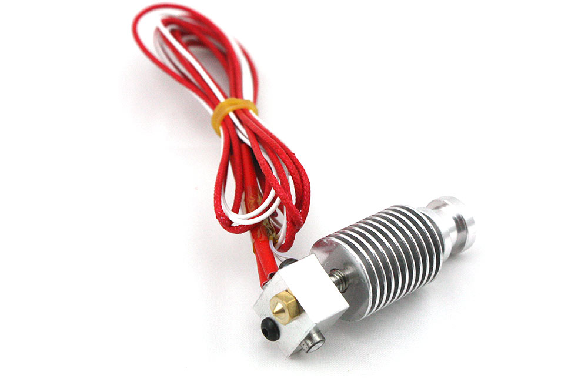

# Hardware Abstraction Layer Documentation

This document describes the hardware abstraction layer (HAL) devices and their architectural abstraction.

# Hardware devices

## Main board

The main CPU board is connected to all further devices which are controlled
by the firmware. The **HAL** supports the following boards.

1. [Raspberry Pi 3 B+](Main_Board/RaspberryPi_3B+/RPI_B3+_Pinout.png)
2. [Raspberry Pi CM3](Main_Board/RaspberryPi_CM3+/RPI_CM3.pdf)

The board is powered by a 5V USB connector.

### Interfaces

The main board supports the following interfaces.

| Interface | Periphery devices               |
|-----------|---------------------------------|
| Ethernet  | -                               |
| I2C       | stepper motor controller boards (1/2) |
| SPI       | ADC board                       |
| GPIO      | relay board, signal input board, ADC board control |
| USB       | -                               |
| UART      | control host                    |
|||

The I2C, SPI and UART interfaces are provided over the GPIO pin header.

### GPIO pin header

| Pin | Name      | Connection                   | \| | Connection   |   Name | Pin |
|:----|:----------|:-----------------------------|:--:|-------------:|-------:|----:|
| 01  | 3.3V DC   |                              | \| |             | 5V DC   | 02 |
| 03  | SDA1 (I2C)|                              | \| |             | 5V DC   | 04 |
| 05  | SCL1 (I2C)|                              | \| |             | GND     | 06 |
| 07  | GPIO 04   | relay-switch-light-run (out) | \| |             | TXD     | 08 |
| 09  | GND       |                              | \| |             | RXD     | 10 |
| 11  | GPIO 17   | adc-control-data-ready (in)  | \| | adc-control-reset (out) | GPIO 18 | 12 |
| 13  | GPIO 27   |                              | \| |             | GND     | 14 |
| 15  | GPIO 22   | adc-control-chipselect (out) | \| | stepper-motor-control-error (in) | GPIO 23 | 16 |
| 17  | 3.3V DC   |                              | \| | stepper-motor-control-reset (out)| GPIO 24 | 18 |
| 19  | MOSI (SPI)|                              | \| |             | GND     | 20 |
| 21  | MISO (SPI)|                              | \| | _reserved_  | GPIO 25 | 22 |
| 23  | CLK (SPI) |                              | \| |             | GPIO 08 | 24 |
| 25  | GND       |                              | \| |             | GPIO 07 | 26 |
| 27  | ID_SD     |                              | \| |             | ID_SC   | 28 |
| 29  | GPIO 05   | signal-button-start (in)     | \| |             | GND     | 30 |
| 31  | GPIO 06   | signal-button-stop (in)      | \| |             | GPIO 12 | 32 |
| 33  | GPIO 13   |                              | \| |             | GND     | 34 |
| 35  | GPIO 19   |                              | \| |             | GPIO 16 | 36 |
| 37  | GPIO 26   | relay-switch-heater-feeder (out) | \| | relay-switch-heater-merger (out) | GPIO 20 | 38 |
| 39  | GND       |                              | \| | relay-switch-light-on (out) | GPIO 21 | 40 |
|||||||

### UART console interface

The UART interface can be used to directly connect with a USB FTTI adapter 
to a console of the device for debugging reason.

**FTTI USB cable:**
| Pin  | Color |
|------|-------|
| TXD  | white |
| RXD  | green |
| -    | red   |
| GND  | black |
|||

---
## Relay board

The relay board is a 8 channel solid-state-relay board, which is used to switch the power
of different devices like heater and signal lights.

**Properties:**

* Board power supply: 5V
* 8 input channels (from main board): 0-0.5V: OFF (low) / 0.5-2.5V: ON (high)
* 8 ouput channels of [Omron G3MB-202P](solid_state_relay/omron-g3mb-202p-ssr-datasheet.pdf) relays: 2A at 100 to 240V AC (50/60Hz)

**Channel occupancy:**

| Channel | Device           | Device type     | Voltage (out) | Power (out) | Color  |
|---------|------------------|-----------------|---------------|-------------|--------|
| 0       | heater-feeder    | filament heater | 12V           | 40W         | red    |
| 1       | heater-merger    | filament heater | 12V           | 40W         | orange |
| 2       | signal-light-on  | LED light       | 3.3V          | -           | yellow |
| 3       | signal-light-run | LED light       | 3.3V          | -           | green  |
| 4       | _unused_         |                 |               |             | blue   |
| 5       | _unused_         |                 |               |             | violet |
| 6       | _unused_         |                 |               |             | gray   |
| 7       | _unused_         |                 |               |             | white  |
| GND     | ground           |                 |               |             | black  |
| DC      | power-supply 5V  |                 |               |             | brown  |
|||||||

### Filament heater

The heater is used to heat the filament up to ~200°C for melting. To control the temperature the heater element
contains a [NTC 100K 3950 temperature sensor](Hot_End_Heater/NTC-3950-100K.pdf). The temperature resistance values
are listed in a [CSV list](Hot_End_Heater/NTC100K_3950.csv) file.

---
## Signal input board

The signal input board is 8 channel input board based on [LTV846 opto-couplers](signal_input_board/LTV_8X6_series.pdf), which protect the
main board from over voltage damages.

**Properties:**

* Board power supply: 5V (out) / 3.3 (in)
* 8 output channels (to main board): 3.3V
* 8 input channels: 5V / max.12V

**Channel occupancy:**

| Channel | Device            | Device type | Color  |
|---------|-------------------|-------------|--------|
| 0       | start-button      | button      | red    |
| 1       | stop-button       | button      | orange |
| 2       | _unused_          |             | yellow |
| 3       | _unused_          |             | green  |
| 4       | _unused_          |             | blue   |
| 5       | _unused_          |             | violet |
| 6       | _unused_          |             | gray   |
| 7       | _unused_          |             | white  |
| GND     | ground            |             | black  |
| DC      | power-supply 3.3V |             | brown  |
|||||

### Button

Simple press button device for interaction with the user.

---
## ADC board

The ADC board is a [Waveshare high-precision AD Hat](Waveshare/RPi_Hight_Precision_AD_Hat/High-Precision_AD_HAT-Doc.pdf) with a
[ADS1263](Waveshare/RPi_Hight_Precision_AD_Hat/Ads126x.pdf) chip, which supports 10 ADC channels. It is constructed as a pin
header board which can be mounted onto the Raspberry Pi pin header. 

**Properties:**

* Board power supply: 5V (RPI 5V out)
* 10 high-precision ADC channels
* Voltage range: 0V - 5V
* ADC resolution: 32 bit
* Max. sample rate: 38kSPS

**Channel occupancy:**

| Channel | Device                 | Device type            | Color  |
|---------|------------------------|------------------------|--------|
| 0       | ntc-temperature-feeder | NTC temperature sensor | red    |
| 1       | ntc-temperature-merger | NTC temperature sensor | orange |
| 2       | pot-rotation-angle     | potentiometer          | yellow |
| 3       | _unused_               |                        | green  |
| 4       | _unused_               |                        | blue   |
| 5       | _unused_               |                        | violet |
| 6       | _unused_               |                        | gray   |
| 7       | _unused_               |                        | white  |
| 8       | _unused_               |                        | black  |
| 9       | _unused_               |                        | brown  |
||||

### NTC temperature sensor

This NTC temperature sensor is used to measure the heater temperature.

**Properaties:**

* NTC sensor
* Resistance: 100K

### Potentiometer rotation sensor

...

---
## Stepper motor control board

The stepper motor control board is a [Pololu Tic T249](Pololu_Tic_T249/UserGuideTic.pdf) based on 
a [TB67S249FTG](Pololu_Tic_T249/TB67S249FTG_datasheet_en.pdf) chip board.

### Stepper motor

---
## Power supply