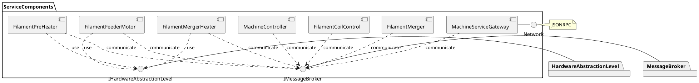

# Sugo Machine Firmware Architecture

## Introduction

This architectural document serves as an introduction to the communication model and
system architecture of SugoMachine.

### Purpose

### Scope

This document covers the general component architecture and the communication model.

### Glosar

| Definitions, Acronyms, Abbreviations     | Description                                                     |
|------------------------------------------|-----------------------------------------------------------------|
| Message                                  | Is the basic communication object for data transmission between components  |
| Event                                    | Basic event which could occur within a component, i.e. triggered by a message. Definition is more used in connection to a state machine | 
|||

---
## General architectural goals and constrains

The SugoMachine firmware provides a _simple_ architecture for the construction of machine systems. In the sense of _simple_ a easy understanding and quick system configuration is possible.
The architecture provides a communication model between its functional components, which is generated by a model-driven-development. With this approach of a loosely coupled system a good scalability is provided. 

---
## Logical view

### State machine

Every components has at least one base state machine, which is triggered by received _events_. Events can be pushed by the component itself, by 
a timer or be caused by received messages from other components. The state machine is configured by the component model.

### Communication model

Components of the system can only interact by using the system communication interface. A direct interaction between components, i.e. by direct calls,
is not allowed and not necessary.
The basic communication object is a message, which can be sent or received by a components.

The following communication types are supported.

* Send message: The message consists of a source, destination and a type. It is sent from the source component to the destination receiver queue. The payload depends on the message type. A send message could be intended as synchronous or asynchronous message. The synchronous message requires a response message. 
* Notification message: The message consists of a source and a type. It is sent from the source component to a group of subscribed components.
* Subscribe message (_not yet implemented_): The message consists of a source, destination and a requested notification type to which the component wants to subscribe. A subscription has always a subscription timeout. If no subscription data has been sent within that time, the subscriber has to confirm the subscription with a re-subscribe message.

([see communication design](CommunicationDesign.md))

#### Messages

Every message triggers a defined behavior on the receiver side and has a defined response message type, except events and notifications. If a message is just used to trigger a state machine transition on the own component side and not used to communicate with an other components, it is called an event.

Messages could be sent as a synchronous or an asynchronous message. If a message is sent synchronously, the sender has to wait for the message associated response message. Asynchronous messages do not block the sender.

Every message which is associated with a response message, contains also a request reference number. The response message has use that message for the response.
A timeout has to be defined for communication processes which wait for a response message. If that time is exhausted the sender has to handle the missing response appropriate.

### Layer model

For a better testability and scalability, the software is devided into layers. Every component is assigned only to one layer.

1. **ServiceComponents**: Contains all components which are responsible for the different internal and external services of the sugo-machine.
A service component in that layer is only callable over the internal or external command interface.

2. **HardwareServiceComponents**: Provides access to hardware components as an service. All components within this layer uses message communication interface and have a state.

3. **HardwareAbstractionLayer**: Exposes an appropriate interface to the underlying hardware of the sugo-machine.
The functionality scope of that layer should be kept lean in order to replace it quickly by new hardware or a test stub.
Components of the HAL layer have no states and no message communication interface.

### ServiceComponents

A component is the smallest logical unit of the architecture which represents a logical unit of the machine. All components are independently from each others in sense of communication. The only way a component can use the service of one other is to use their interface directly or over the command interface (e.g. ServiceComponents).

#### FilamentMerger

The FilamentMerger is the biggest unit of the machine. It is responsible for merging the filament with the hemp cord.
The FilamentMerger is based on the following HardwareServiceComponents.

* FilamentFeederMotor
* FilamentPreHeater
* FilamentMergerHeater

#### FilamentCoilControl

The FilamentCoil is coiling up the cooled down filament at the end. It is responsible to track the speed of the filament and to control
its speed according to that so the filament does not hangs too limp or tight.
The FilamentCoil is based on the following HardwareServiceComponents.

* FilamentCoilMotor
* StrainSensor

#### MachineController

The MachineController is responsible for the over all control of all sub components in the machine. It is responsible to start and stop the machine
in regard to the user input or to communicate with the outer world.

### Common Modules

#### Common

The Common module contains of common classes which are used as general utilities for the whole system.

#### MessageBroker

The MessageBroker module is the base communication interface between all ServiceComponents. It is directly delegated within the class ServiceComponent, which also translates all command messages to the according state machine events.

## Process view

## Development view

## Physical view

## Scenarios (Use Cases)

