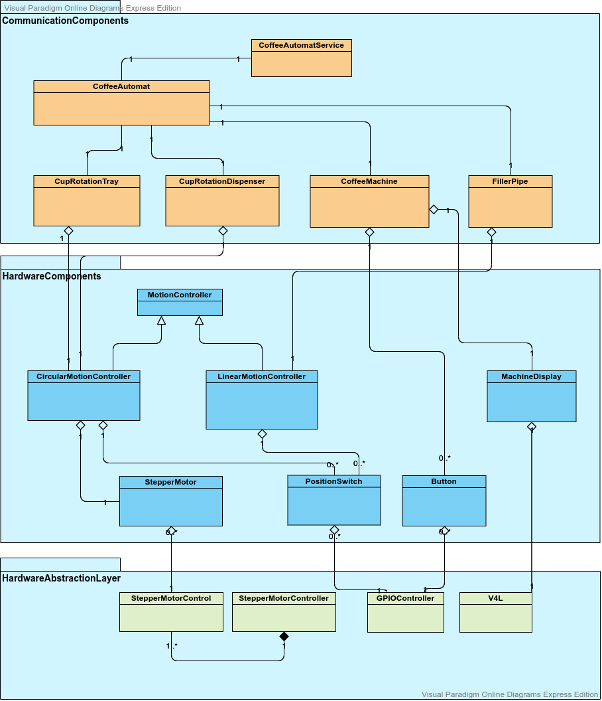
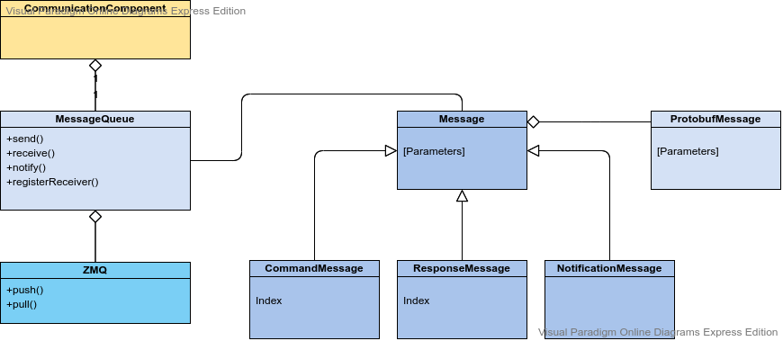

# CoffeeMachine Software Architecture

This document describes the architectural view of the CoffeeAutomat software package.

# Overview

# Components

## MessageQueue

The MessageQueue component is the base Communication interface between all CommunicationComponents.

