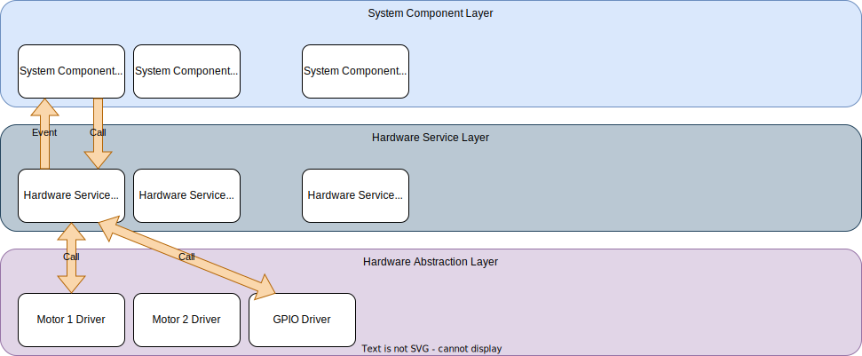
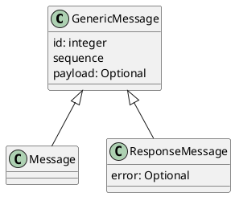
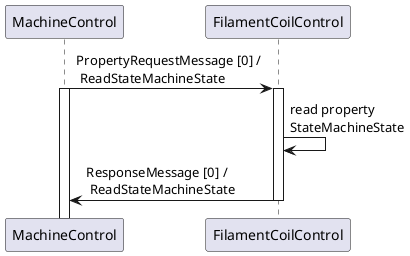
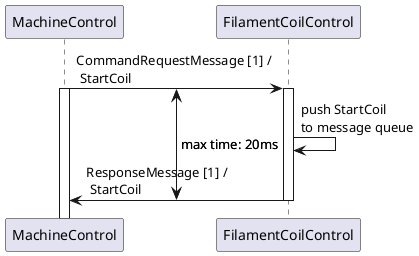
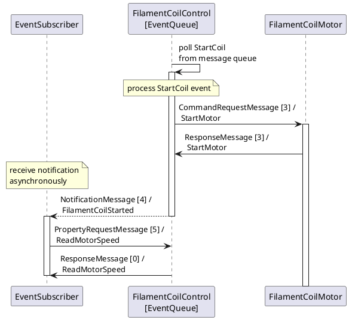
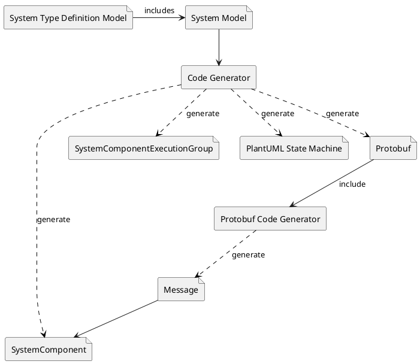

# Sugo Machine Firmware Architecture

## Introduction

This document describes the architecture of the **Sugo** machine framework. The Sugo machine software framework is intended to provide a very simple configurable and scalable software specially for driving complex machines with a lot of components in it.

The machine framework and machine design was original intended to build and run the Sugo machine, which is a kind of filament merger machine. Because that concept worked very well, I decided to provide it as an open source code project to learn from and to drive the software development further by the community.

### Scope

This document covers the Sugo machine architecture in generally in means of a framework, as well as the specialized architecture of the example Sugo machine as it is implemented here. It should make the basic concepts, components and the communication model understandable.

### Glossary

| Definitions, Acronyms, Abbreviations     | Description                                                     |
|------------------------------------------|-----------------------------------------------------------------|
|_|_|
|||

### Refernces

| Description | Link |
|-------------|------|
| Kruchten, Philippe (1995, November) | [Architectural Blueprints — The “4+1” View Model of Software Architecture. IEEE Software 12 (6), pp. 42-50.](https://www.cs.ubc.ca/~gregor/teaching/papers/4+1view-architecture.pdf) |
|||

### Overview

This architecture document is based on the '4+1 architecture view model'.

All chapters have a general framework description part and a machine specialized part, which describes the machine components in detail. This document is not meant to be ready or complete, but should help the developer to understand the basic concepts.

## General architectural goals and constrains

The architecture was introduced to provide a framework which makes it possible to construct complex machine systems quickly, easily and robust by design as well as easy scalable with a minimum of development time overhead.

The overall general principles which should be applied for the architecture and the software design are **KISS** (_Keep It Simple Stupid_), **DRY** (_Don't Repeat Yourself_) and **YAGNI** (_You Aren't Gonna Need It_).

The major goals of this architecture are:

* **Simplicity**: Reduce system complexity to make the system and code easy understandable. The architecture makes it possible to only add or adapt parts of the system, with only focus on the ROI (region of interest). This makes it possible to identify potential problems early in the design and prevent errors in advance.
* **Maintainability**: The system model design has to be quickly maintainable and adaptable, which reduces the effort of refactoring.
* **Scalability**: Additional components, functionality or new hardware parts must be addable easily without the need of long development processes.
* **Robustness**: The code generation from machine model must provide a stable functioning system and reduce potential errors. That property should be provided by design.

> **_NOTE:_**  It is important to clearly name all service components and not introduce synonyms to ensure an easy-to-understand software system and traceability from documents to code!

## Logical view

The system fundamental building blocks are (service) components. A service component is a independently working instance of the system, which offers a special services to other internal or external components. Each service component has a specific task, like controlling special parts of the system hardware. All service components are as less as possible coupled to make them running and adaptable independently. Only the specified message communication connects the appropriate components together and enables communication interaction between the components.

The architecture applies the **Active Object** design pattern to the service component as the major system model design concept. As an active object, a service component handles received messages in one message (real-time) process thread.

### Layer model

For a better testability and scalability, the software ist divided into three layers. Every software module is assigned only to one layer.

1. **System Component Layer**: Provides the service components and application business logic. Only service components of this layer could communicate with each other.

2. **Hardware Service Layer**: Provides logical access to hardware components, i.e. stepper motor, as a service and could provide a more extensive functionality as the _Hardware Abstraction Layer_ component could do. Components which have to interact with the system hardware could use multiple hardware service interfaces from this layer. The communication between this layer and the upper service component layer can be synchronously, per downward calls or asynchronously, by hardware caused events which are directed to the service component message queue.
Components of this layer shouldn't have a internal state. States must only be handled by the overlying layer!

3. **Hardware Abstraction Layer**: Provides an appropriate interface to the underlying system hardware and contains driver components to access the hardware functionality. The range of function of layer components has to be kept lean and stateless. The layer must be replaceable easily by new hardware or test stubs.

Components of this layer could only be accessed in a synchronous way from the overlying layer!

The **Hardware Service Layer** together with the **Hardware Abstraction Layer** could provide real-time.

### Service components

All service components together build a loosely coupled system, which is only coupled by an event driven communication architecture (EDA). That approach provides the scalability and flexibility as well as the required robustness of the system.

A component communication data and state model is used as the base for the model driven system development (MDD) approach. This ensures that the communication structure can be adapted quickly and less error-prone, which makes the system very robust and well maintainable.

#### State machine

Every service component contains an own state machine and has a defined state. A state machine state transition can only be triggered by events, which
can be received from other components or internally pushed. The component state machine transition processing, HAL services or a timer can cause an internal event, for example. An event is always processed asynchronously from the message queue processing, which will not have a real-time affinity.

The state machine states and transitions are generated by the propagated system model. Every transition handler has an default behaviour and is not needed to be implemented manually if not necessary.

Received events are always pushed to the message queue of the appropriate service component. The component has an internal separated processing thread which consumes every event step by step as long as there are more events in the queue. If all queue items are polled and processed, the message queue thread will wait for new events. Every message queue processing thread runs in its own thread context, like in a sandbox, and is not allowed to access any other data from other contexts. That guarantees data access without any race conditions.

#### Properties

Properties are a kind of component specific data points which can be read out, written or subscribed to. Depending on how they are modelled, they could have different access restriction like _ReadOnly_ or _ReadWritable_. At any time, they can be read out internally or externally (synchronously) by other components. If a component is interested in value changes of a _Property_, it could subscribe to it as well, which will causes a notification message to be sent to the component.

An implicitly created _Property_ is the _StateMachineStateProperty_ which is always provided by every stated service component.

### Message broker

Components of the system can only interact by using the system communication interface, which is only provided by the _MessageBroker_ interface. A direct interaction between components, i.e. by direct calls, is not allowed and not possible by design. The basically transmitted communication object is a _Message_, which can be sent or received by a component.

The specific messaging behavior is transparent for every service component, to make it replaceable according to the underling system. Service components only take care about which service they want to call by the service identifier. The service identifier consists of the service component address and service topic. , and its needed parameters in order to call it.

Components always uses the _MessageBroker_ interface to send and receive messages. Which message could be received or sent to which other component is always pre-defined by the system model.

([see communication design](CommunicationDesign.md))

#### Messages

The _Message_ is the basic type for message transmission between components. Every message is identifiable by its unique service identifier (id), i.e. like _'FilamentMergerMotor.StartMotor'_ and its consecutive sequence number. For efficiency reason the service identifier will be used as an unique hash value. The sequence number is always increased by every request or notification message sent.

Messages can be sent in a synchronous or an asynchronous way from one service component to another. If a message is sent synchronously, the sender has to wait for the message associated response message, whereas asynchronous messages do not block the sender.

Because the system provides a non blocking event driven architecture, synchronously sent notification messages, like command messages, will be processed asynchronously by the service component message queue. This guarantees that the sender is not blocked by a long term processing of the message on the receiver side. Additionally, this also avoids deadlocks in cases a request processing component is requesting the requester again. If the sender wants to receive notification messages from another service component, it has to subscribe to its notification message channel.

Every request message is expected to be responded by the receiver. A response message always contains the same message identifier like the request message, which associates the response to a previous request. Every request has a maximum timeout, which has to be defined by system design. If that time is exhausts, the sender has to handle the missing response appropriate.

The communication model knows two basic types of messages:

**Message**:

Basic message type, which is used for synchronous and asynchronous send messages. A _Message_ is identifiable by its unique message identifier (ID), which implicitly defines an service instance, i.e. like a service component and the service or event itself.

A synchronous sent message is always sent over the request message channel, whereas an asynchronous sent message is sent over the notification message channel.

**ResponseMessage**:

Response transmitting message type, used to send a response in regard to property request or command message back to the requester. The message could contain requested data or an error result.

Based on the basic message types there are three sub types, which are differed by its usage and communication channel:

**NotificationMessage**:

An asynchronously sent message with optional parameters, used to publish events, i.e. like state change or motor stop. Every notification message is published without taking care about which subscriber will receive it or not. The receive of an notification message cannot be guaranteed, so it could also get lost by connection interruption.

**RequestMessage**:

A synchronously sent request message with optional parameters, used to request the processing of a command (_CommandRequestMessage_) of a service component, i.e. like start motor rotation, or to request the read or write of a property (_PropertyRequestMessage_) value of the service component, i.e. like current motor speed.

Every command request message is guaranteed to be received and to be added to the processing queue of the service component, if the sender has received the appropriate response message. The immediate processing of the command is not guaranteed, because it will be done asynchronously in regard to the processing queue content. Further command processing states can be notified as notification messages, depending on the command type.

A property request message is not allowed to be blocked by the receiving service component. The requested property value must be written or read, if possible, immediately.

#### Common module

The Common module contains all common classes, utilities and data type definitions, which can be used from all other packages within the whole system.

### Remote control module

### Gateway

## Process view

### System component state machine

#### Error handling

### Message processing

All messages are processed in a non-blocking manner. In case that a response is expected as reply of a request message or command message, the requested component must not block the response in a long term.

A _PropertyRequestMessage_ message could read or write some data, and the _ResponseMessage_ message is sent back immediately to the requestor. 

A received _CommandRequestMessage_ will cause a command processing on receiver side. The message receive is immediately responded by a _ResponseMessage_ and the command is queued for the asynchronous processing.

Within the looped message queue processing a command message is popped from the queue and the processing is started asynchronously to the request. An optional state change notification messages will also be sent asynchronously.

## Development view

### Dependency Inversion

For loosely coupling of system classes, dependency inversion has to be used. Classes must only be passed by its appropriate defined interface to the consuming classes. The dependency inversion guarantees an easy testability of the software parts.

Only bundle and factory classes are allowed to handle concrete classes.

### Resource Locator

Objects, which have to be used deep within the subclass hierarchy, should be passed by a _ResourceLocator_ class to not couple uninterested classes to the past object class. Resource locator item objects mostly provide a global cross-cutting facility to the system, i.e. like a configuration or hardware abstraction interface.

### Model Driven Development (MDD)

The model driven development approach must be used to design the overall system behaviour and structure. The system model is configured within the system model configuration file (YAML). That configuration file is used further to create all needed classes and types by a code generator.

### Memory usage and allocation

### Package structure

### Deployment

## Physical view

## Scenarios (Use Cases)

