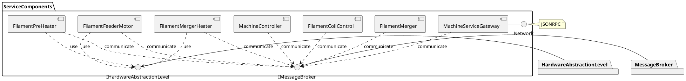
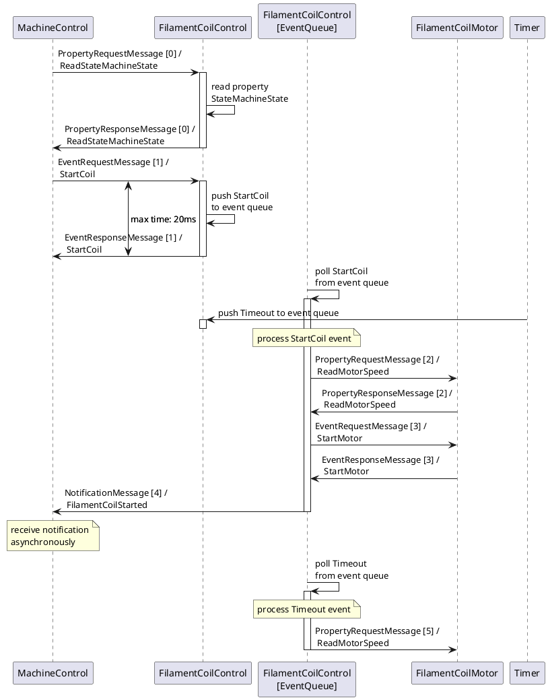
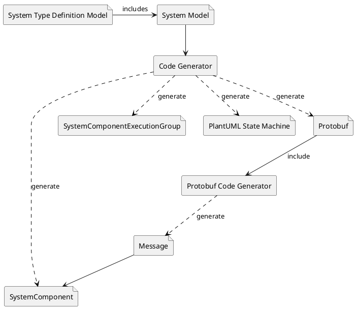

# Sugo Machine Firmware Architecture

## Introduction

This document describes the architectural concept of the Sugo machine architecture. All chapter start with a general concept or specification part and describe the Sugo specific part at the end.

### Purpose

Purpose

### Scope

This document covers the service component architecture and the applied communication model. Because the communication framework provides a general usage, the architecture document will only describe the general concepts. 

### Glosar

| Definitions, Acronyms, Abbreviations     | Description                                                     |
|------------------------------------------|-----------------------------------------------------------------|
|_|_|
|||

---
## General architectural goals and constrains

The architecture should make it possible to construct complex machine systems quickly, easily and robust by design as well as easy scalable. The major goals are:

* **Simplicity**: Reduce system complexity and the need to adapt or program parts, with only focus on the ROI (region of interest) in order to add or adapt functionality. Make the system easy to understand to spot potential problems early in the design.
* **Maintainability**: The system model design has to be quickly maintainable and adaptable, which reduces the effort refactoring.
* **Scalability**: Additional components, functionality or new hardware parts must be addable easily without the need of long development processes.
* **Robustness**: The model generation must provide a stable functioning system and reduce potential errors. That property should be provided by design.

The general principles to be applied are **KISS** (_Keep It Simple Stupid_), **DRY** (_Don't Repeat Yourself_) and **YAGNI** (_You Aren't Gonna Need It_).

---
## Logical view

The architecture applies the **Active Object** design pattern as the major system model design concept. For this purpose the entire system is constructed by loosely coupled components. A component is the basic functional unit within the system. It provides a unique function to the system, i.e. like a motor control and has no direct dependencies to other components, in sense of program design, except of a modeled messaging interface. Only the specified message communication connects the appropriate components together and enables communication interaction between the components.

### Layer model

For a better testability and scalability, the software are divided into 3 layers. Every software package is assigned only to one layer.

1. **System Component Layer**: Provides the system components and application business logic. Only within this layer different system components could communicate with each other.

2. **Hardware Service Layer**: Provides a logical access to hardware components, i.e. stepper motor, as an service and could provide a more extensive functionality as the _Hardware Abstraction Layer_ component could do. Components which have to interact with the system hardware could use multiple hardware service interfaces from this layer. The communication between this layer and the upper system component layer can be synchronously, per downward calls or asynchronously, by hardware caused events which are directed to the system component event queue.
Components of this layer shouldn't have a internal state. States must only be handled by the overlying layer!

3. **Hardware Abstraction Layer**: Provides an appropriate interface to the underlying system hardware and contains driver components to access the hardware functionality. The range of function of layer components has to be kept lean and stateless. The layer must be replaceable easily by new hardware or test stubs.<\br>
Components of this layer could only be accessed in a synchronously way from the overlying layer!

### System components

All system components together build a loosely coupled system, which is only coupled by an event driven communication architecture (EDA). That approach provides the scalability and flexibility as well as the required robustness of the system.

A component communication data and state model is used as the base for the model driven system development (MDD) approach. This ensures that the communication structure can be adapted quickly and less error-prone, which makes the system very robust and well maintainable.

#### State machine

Every system component has an own state machine, which is triggered by received _EventMessage_ messages or pushed events from within the state transition processing. Events can also be caused internally by component internal objects, i.e. by timer events or HAL service events. In every case an event trigger must be treated as an asynchronous signal, which will not have a real-time affinity.

The state machine states and transitions are generated by the propagated system model. Every transition handler has an default behavior und is not needed to be implemented if not necessary.

Received events are always pushed to the event queue of the appropriate system component. The component has an internal processing thread which consumes every event step by step as long as there are more events in the queue. If all queue items are polled and processed the event queue thread will wait for new events. This event queue processing thread runs in its own thread context, like in a sandbox and is not allowed to access any other data from other contexts. That guarantees data access without any race conditions.

#### Properties

Properties are a kind of component specific data points which can be read out, written or subscribed to. Depending on how they are modeled they could have different access restriction like _ReadOnly_ or _Writable_. At any time they can be read out internally or externally (synchronously) by other components. If a component is interested in value changes of a _Property_ it could subscribe to it as well, which will causes _NotificationMessage_ to be sent to the component.

An implicitly created _Property_ is the _StateMachineStateProperty_ which is always provided by every component.

#### Sugo specific components

##### Machine Control

The _MachineControl_ is the central machine controller component. It coordinates all sub components of the machine, so they could work together. The machine control provides an interface to be controlled from a user input or from a gateway routed communication. For example it is responsible to start and stop the machine and to handle error states.

##### Filament Merger

The FilamentMerger is the biggest unit of the machine. It is responsible for merging the filament with the hemp cord.
The FilamentMerger is based on the following HardwareServiceComponents.

* FilamentFeederMotor
* FilamentPreHeater
* FilamentMergerHeater

##### Filament Coil Control

The FilamentCoil is coiling up the cooled down filament at the end. It is responsible to track the speed of the filament and to control
its speed according to that so the filament does not hangs too limp or tight.
The FilamentCoil is based on the following HardwareServiceComponents.

* FilamentCoilMotor
* StrainSensor

<!-- 
#FIXME move that to concrete design!
Example:

##### EventRequestMessage

The _EventRequestMessage_ message is sent to a single component to push an event to their event queue. The reception, but not the processing, of the event is answered by an _EventResponseMessage_.

##### EventResponseMessage

The _EventResponseMessage_ is sent as a response of the _EventRequestMessage_ message with the appropriate response code.

##### PropertyRequestMessage

The _PropertyRequestMessage_ message is sent to a single component to requests a component property for reading, writing or subscribing. The result of the processed request is answered by a _PropteryResponseMessage_.

##### PropertyResponseMessage

The _PropertyResponseMessage_ is sent as a response of the _PropertyRequestMessage_ message with the appropriate response code and requested data.

##### NotificationMessage

The _NotificationMessage_ is sent as a notification from the sender, which could be received by multiple receivers which have been subscribed to it.

#### MessageBroker

The MessageBroker module is the base communication interface between all system components. It is directly used from the class _SystemComponent_ in which all messages are translated to the appropriate type and be handled.

#### Common

The Common module contains all common classes and utilities which can be used from all other packages within the whole system.

### Remote control

### Gateway

<!--  -->

## Process view

### System component state machine

#### Error handling

### Message processing

Generally, all messages are processed in a non-blocking manner. A simple _PropertyRequestMessage_ message could read or write some data and the _PropertyResponseMessage_ message is sent back immediately to the requestor. If a request message, like a _EventRequestMessage_, would causes a sub processing, only the reception is immediately sent back. The processing of that event is started asynchronously to the request and also a resulting notification will be sent asynchronously.

## Development view

### Dependency Injection

For loosely coupling of system classes, specially beyond the package border, dependency injection has to be used. Classes must only be passed by interface definitions to consuming classes. The dependency injection guarantees a easy testability of the software parts.

### Resource Locator

Objects which have to be passed deeply through sub-class hierarchy, should be passed by a _ResourceLocator_ class to not couple uninterested classes to the passed object class.

### Model Driven Development (MDD)

The model driven development approach must be used to design the overall system behavior and structure. The system model is configure within the system model configuration file (YAML). That configuration file is used further to create all needed classes and types by a code generator.

### Package structure

### Deployment

## Physical view

## Scenarios (Use Cases)

