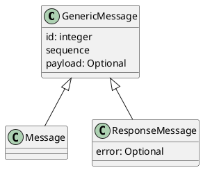
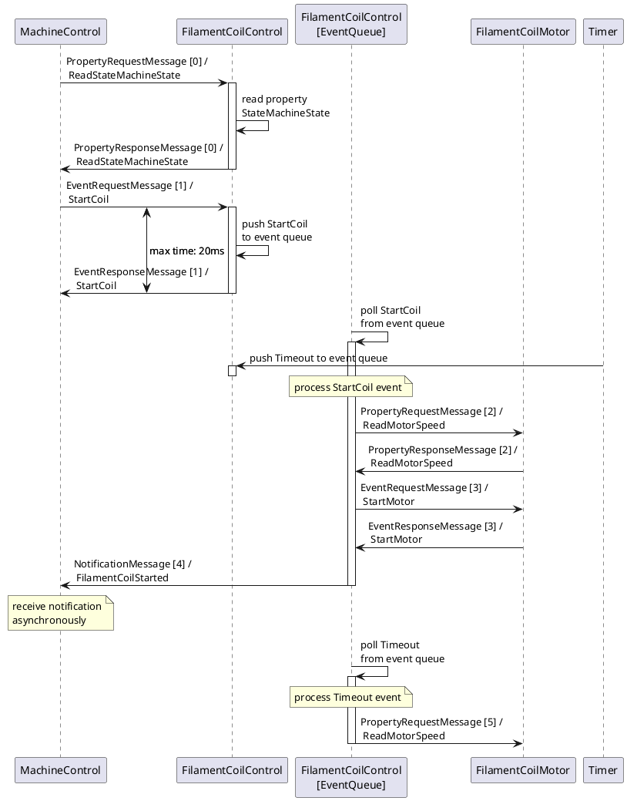
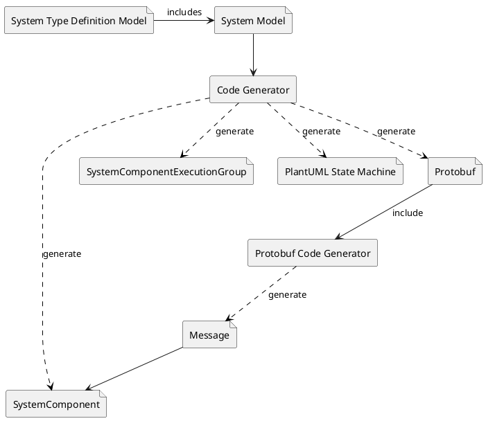

# Sugo Machine Firmware Architecture

## Introduction

This document describes the architecture of the **Sugo** machine framework. The Sugo machine software framework is intended to provide a very simple configurable and scalable software specially for driving complex machines with a lot of components in it.

The machine framework and machine design was original intended to build and run the Sugo machine, which is a kind of filament merger machine. Because that concept worked very well, I decided to provide it as an open source code project to learn from and to drive the software development further by the community.

### Scope

This document covers the Sugo machine architecture in generally in means of a framework, as well as the specialized architecture of the example Sugo machine as it is implemented here. It should make the basic concepts, components and the communication model understandable.

### Glossary

| Definitions, Acronyms, Abbreviations     | Description                                                     |
|------------------------------------------|-----------------------------------------------------------------|
|_|_|
|||

### Refernces

### Overview

This architecture document is based on the '4+1 architecture view model'.

All chapters have a general framework description part and a machine specialized part, which describes the machine components in detail. This document is not meant to be ready or complete, but should help the developer to understand the basic concepts.

---
## General architectural goals and constrains

The architecture was introduced to provide a framework which makes it possible to construct complex machine systems quickly, easily and robust by design as well as easy scalable.

The overall general principles which should be applied for the architecture and the software design are **KISS** (_Keep It Simple Stupid_), **DRY** (_Don't Repeat Yourself_) and **YAGNI** (_You Aren't Gonna Need It_).

The major goals of this architecture are:

* **Simplicity**: Reduce system complexity and the need to adapt or program parts, with only focus on the ROI (region of interest) in order to add or adapt functionality. Makes the system easy understandable to spot potential problems early in the design as well as prohibit errors in advance.
* **Maintainability**: The system model design has to be quickly maintainable and adaptable, which reduces the effort of refactoring.
* **Scalability**: Additional components, functionality or new hardware parts must be addable easily without the need of long development processes.
* **Robustness**: The code generation from machine model must provide a stable functioning system and reduce potential errors. That property should be provided by design.

> **_NOTE:_**  It is important to clearly name all service components and not introduce synonyms to ensure an easy-to-understand software system and traceability from documents to code!

---
## Logical view

The architecture applies the **Active Object** design pattern as the major system model design concept. For this purpose, the entire system is constructed by loosely coupled components. A component is the basic functional unit within the system. It provides a unique function to the system, i.e. like a motor control and has no direct dependencies to other components, in sense of program design, except of a modelled messaging interface. Only the specified message communication connects the appropriate components together and enables communication interaction between the components.

---
### Layer model

For a better testability and scalability, the software are divided into 3 layers. Every software module is assigned only to one layer.

1. **System Component Layer**: Provides the service components and application business logic. Only service components of this layer could communicate with each other.

2. **Hardware Service Layer**: Provides logical access to hardware components, i.e. stepper motor, as a service and could provide a more extensive functionality as the _Hardware Abstraction Layer_ component could do. Components which have to interact with the system hardware could use multiple hardware service interfaces from this layer. The communication between this layer and the upper service component layer can be synchronously, per downward calls or asynchronously, by hardware caused events which are directed to the service component event queue.
Components of this layer shouldn't have a internal state. States must only be handled by the overlying layer!

3. **Hardware Abstraction Layer**: Provides an appropriate interface to the underlying system hardware and contains driver components to access the hardware functionality. The range of function of layer components has to be kept lean and stateless. The layer must be replaceable easily by new hardware or test stubs.<\br>
Components of this layer could only be accessed in a synchronous way from the overlying layer!

The **Hardware Service Layer** together with the **Hardware Abstraction Layer** could provide real-time.

### Service components

All service components together build a loosely coupled system, which is only coupled by an event driven communication architecture (EDA). That approach provides the scalability and flexibility as well as the required robustness of the system.

A component communication data and state model is used as the base for the model driven system development (MDD) approach. This ensures that the communication structure can be adapted quickly and less error-prone, which makes the system very robust and well maintainable.

#### State machine

Every service component contains an own state machine and has a defined state. A state machine state transition can only be triggered by events, which
can be received from other components or internally pushed. The component state machine transition processing, HAL services or a timer can cause an internal event, for example. An event is always processed asynchronously from the event queue processing, which will not have a real-time affinity.

The state machine states and transitions are generated by the propagated system model. Every transition handler has an default behaviour and is not needed to be implemented manually if not necessary.

Received events are always pushed to the event queue of the appropriate service component. The component has an internal separated processing thread which consumes every event step by step as long as there are more events in the queue. If all queue items are polled and processed, the event queue thread will wait for new events. Every event queue processing thread runs in its own thread context, like in a sandbox, and is not allowed to access any other data from other contexts. That guarantees data access without any race conditions.

#### Properties

Properties are a kind of component specific data points which can be read out, written or subscribed to. Depending on how they are modelled, they could have different access restriction like _ReadOnly_ or _ReadWritable_. At any time, they can be read out internally or externally (synchronously) by other components. If a component is interested in value changes of a _Property_, it could subscribe to it as well, which will causes a notification message to be sent to the component.

An implicitly created _Property_ is the _StateMachineStateProperty_ which is always provided by every stated service component.

### Communication model

Components of the system can only interact by using the system communication interface. A direct interaction between components, i.e. by direct calls, is not allowed and not possible by design. The basically transmitted communication object is a _Message_, which can be sent or received by a component. 

The specific messaging behaviour is transparent for the service component, to make it replaceable according to the underling system. Service components only take care about the service identifier, which consists of the service component address and service topic, and it needed parameters in order to call it.

Components always uses the _MessageBroker_ interface to send and receive messages. Which message could be received or sent to which other component is always pre-defined by the system model.

([see communication design](CommunicationDesign.md))

#### Messages

The _Message_ is the basic type for data and event transportation between components.

The communication model knows four (sub-) types of messages:

* **Event message**: A synchronous request message used to transport events and its parameters to the receiver. Every request message is guaranteed to be received by the called component, but is processed asynchronously.
* **Property message**: A synchronous request message to request a component property. The requested data is directly delivered by the receiver and
must not be blocked in any kind.
* **Response message**: Used to send a response of a request message, like for event or property messages. The message can return requested data,
error results or just nothing.
* **Notification message**: Used to notify a state change. They are sent asynchronously in a fire and forget manner and the publisher doesn't care
about receiving of the subscriber.

Generally, messages can be sent in a synchronous or an asynchronous way. If a message is sent synchronously, the sender has to wait for the message associated response message, whereas asynchronous messages do not block the sender.

Because the system provides an event driven architecture, event messages are synchronously transferred but asynchronously processed by the component event queue. This guarantees that the sender is not blocked by the processing of the event on the receiver side. If the sender has to wait for an event process by the receiver, it has to subscribe to the receiver's state change notification.

Every request message is expected to be responded by the receiver. A request and response message always contains a unique request sequence number, which associates the response to a previous request. The request sequence number is increased by every request. Every request has a maximum timeout, which has to be defined by system design. If that time is exhausted, the sender has to handle the missing response appropriate.

#### MessageBroker

The _MessageBroker_ module is the base communication interface between all service components. It is directly used from the class _SystemComponent_ in which all messages are translated to the appropriate type and be handled.

#### Common module

The Common module contains all common classes, utilities and data type definitions, which can be used from all other packages within the whole system.

### Remote control module

### Gateway

#### Sugo specific service components

##### MachineControl

The _MachineControl_ is the central machine controller component. It coordinates all subcomponents of the machine, so they work in a sufficient way together. The _MachineControl_ component provides an interface, which can be controlled from a user input or from a gateway routed communication. For example, it is responsible to start and stop the machine and to handle error states.

##### FilamentCoilControl

##### FilamentCoilMotor

##### FilamentMergerControl

##### FilamentMergerHeater

##### FilamentFeederControl

##### FilamentFeederMotor

##### FilamentPreHeater

##### FilamentTensionSensor

##### UserInterfaceControl

## Process view

### System component state machine

#### Error handling

### Message processing

Generally, all messages are processed in a non-blocking manner. A simple _PropertyRequestMessage_ message could read or write some data, and the _PropertyResponseMessage_ message is sent back immediately to the requestor. If a request message, like a _EventRequestMessage_, would cause a sub processing, only the reception is immediately sent back. The processing of that event is started asynchronously to the request, and also a resulting notification will be sent asynchronously.

## Development view

### Dependency Inversion

For loosely coupling of system classes, dependency inversion has to be used. Classes must only be passed by its appropriate defined interface to the consuming classes. The dependency inversion guarantees an easy testability of the software parts.

Only bundle and factory classes are allowed to handle concrete classes.

### Resource Locator

Objects, which have to be used deep within the subclass hierarchy, should be passed by a _ResourceLocator_ class to not couple uninterested classes to the past object class. Resource locator item objects mostly provide a global cross-cutting facility to the system, i.e. like a configuration or hardware abstraction interface.

### Model Driven Development (MDD)

The model driven development approach must be used to design the overall system behaviour and structure. The system model is configured within the system model configuration file (YAML). That configuration file is used further to create all needed classes and types by a code generator.

### Memory usage and allocation

### Package structure

### Deployment

## Physical view

## Scenarios (Use Cases)

