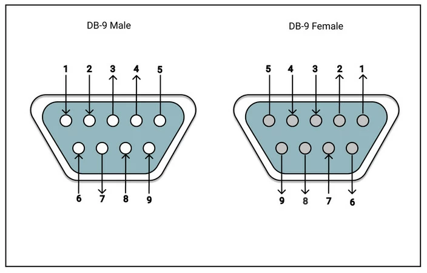

# Bus Connection Wiring

## Universal Sub-D 9 Pinout

The ribbon cable coloring is as follows.

| Pin Number     | Cable Color     |
|----------------|-----------|
| 1              | 
black
 |
| 2              | 
grey
 |
| 3              | 
blue
 |
| 4              | 
yellow
 |
| 5              | 
red
 |
| 6              | 
white
 |
| 7              | 
violet
 |
| 8              | 
green
 |
| 9              | 
orange
 |

## Motor Control Connection

For motor control use a sub-d plug with ribbon cable is used to transport the signals.

| Pin                                            | Signal      | Description             | GPIO pin (Raspberry Pi)  |
|------------------------------------------------|-------------|-------------------------|--------------------------|
| 
1
  | GND         | Ground                  | 39                       |
| 
2
   | SDA         | I2C SDA Signal (3.3V)   | 03                       |
| 
3
   | ERR         | Error In Signal (3.3V)  | 33                       |
| 
4
 | RST         | Reset Signal (3.3V)     | 35                       |
| 
5
    | POWER_3_3V  | power supply (+3.3V)    | 01                       |
| 
6
  | SDL         | I2C SDL Signal (3.3V)   | 05                       |
| 7    | -           | -                  | -                        |
| 8    | -           | -                  | -                        |
| 9    | -           | -                  | -                        |
